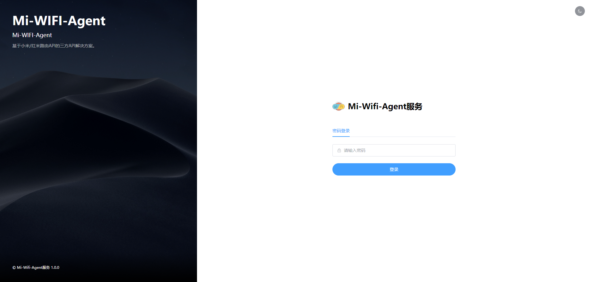
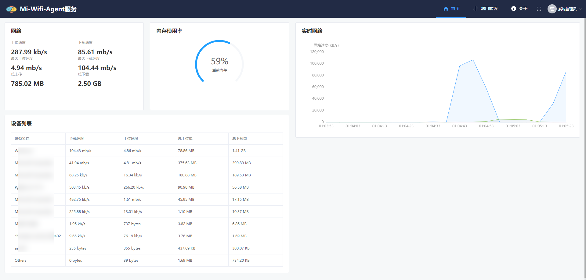
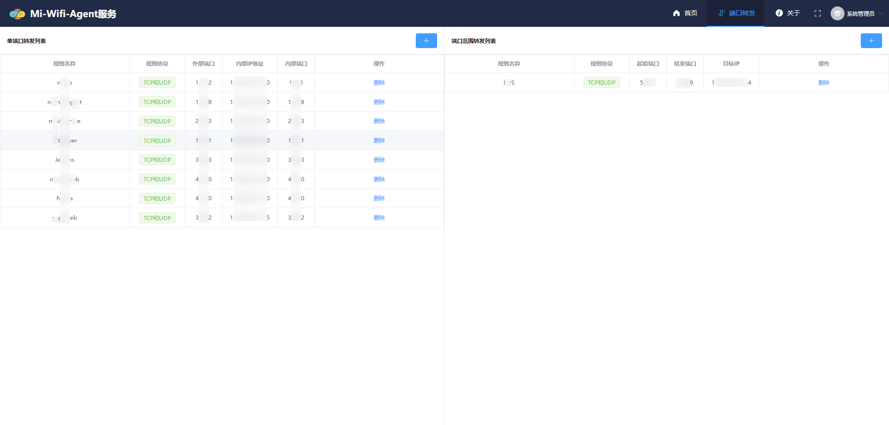

# Mi-Wifi-Agent 服务

## 简介
小米/红米路由器基于官方固件API接口实现的第三方管理服务。

## 效果展示







## 对接计划

- [x] 系统鉴权
- [x] 路由器状态
- [x] 端口转发
- [x] 设备列表
- [x] 前端界面

## Docker部署

```bash
docker pull bcrjl/miwifi-agent:latest

docker run -d --name miwifi-agent \
--restart always \
-p 24317:24317 \
-e BMW_URL=192.168.31.1 \
-e BMW_PASSWORD=123456 \
-e WEB_PASSWORD=123456 \
miwifi-agent:latest
```


### 阿里镜像

```bash
docker pull registry.cn-hangzhou.aliyuncs.com/bcrjl/miwifi-agent:latest

docker run -d --name miwifi-agent \
--restart always \
-p 24317:24317 \
-e BMW_URL=192.168.31.1 \
-e BMW_PASSWORD=123456 \
-e WEB_PASSWORD=123456 \
miwifi-agent:latest
```

`BMW_URL` 指路由器IP地址

`BMW_PASSWORD` 指路由器密码

`WEB_PASSWORD` 平台设置的密码

运行成功后访问 `http://[IP]:24317`

## 版本计划

### 1.0.0

- 项目初始化搭建；
- 系统状态对接；
- 端口映射对接；
- 搭建前端页面；
